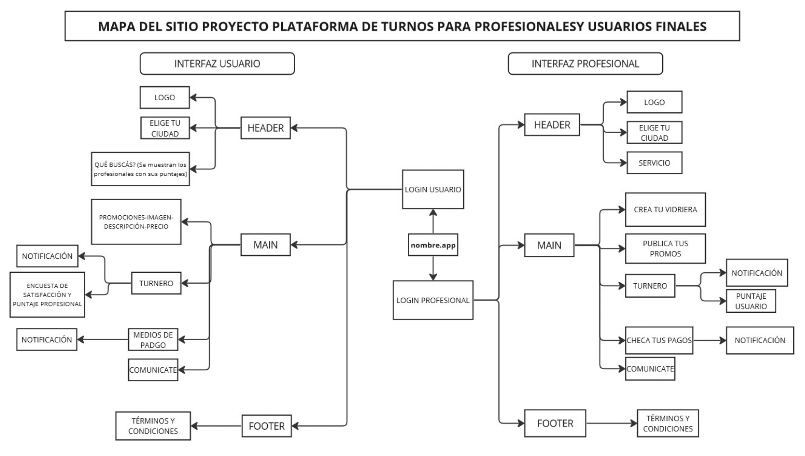

##Simulación 1 - Rol - Tester - No - Country

Este repositorio documenta las atreas realizadas en mi primera simulación de No-Country

Mi rol fue TESTER Y DOCUMENTALISTA, único mienbro no code del quipo.

Mis objetivos:
  1) Trabajar en equipo, remoto.
  2) Vivir la experiencia de desarrollar un producto.
  3) Aplicar conocimientos y herramientas aprendidos.
  4) Aprender nuevas herramientas.

Link al proyecto: https://github.com/No-Country/C16-74-n-python.git

## Algunas de las tareas que realicé:

[HISTORIAS DE USUARIO]()

MAPA DEL SITIO GoFitApp_page-0001.jpg
